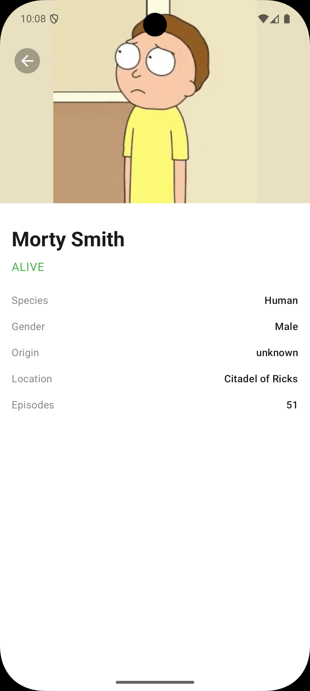
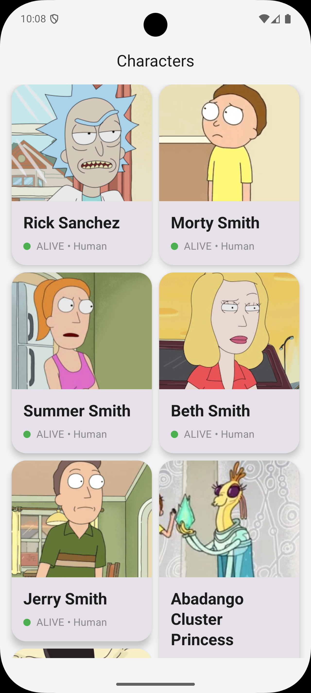

# 🛸 Rick and Morty Android App

A modern **Android application** built with **Jetpack Compose**, following **Clean Architecture** principles and showcasing **shared element transitions**, **pagination**, and **modularization**.

This project consumes the **Rick and Morty API** to display characters, supports smooth navigation from a **Home screen** to a **Details screen**, and is structured for scalability and testability.

---

## 📱 Preview

### Screenshots

<p align="center">
  
  
</p>

### Demo Video

> 🎥  watch the shared element transition in action


---

## ✨ Features

* 🧭 **Jetpack Navigation (Compose)**
* 🔄 **Shared Element Transitions** (Home → Details)
* ⚡ **Pagination** for character list
* 🎨 **Dynamic UI theming** using Palette API
* 🧠 **Unidirectional state management** with StateFlow
* 🧪 **UI-ready architecture** (easy to test)

---

## 🧱 Architecture

The project follows **Clean Architecture** with a **multi-module setup**:

```
root
├── app        # UI layer (Compose, Navigation, ViewModels)
├── domain     # Business logic (UseCases, Entities)
└── data       # Data sources (API, Repositories)
```

### 🔹 app module

* Jetpack Compose UI
* Navigation graph
* Shared element transitions
* ViewModels (Hilt-injected)
* UI state & presentation logic

### 🔹 domain module

* Pure Kotlin module
* Business logic
* UseCases
* Domain models (e.g. MovieCharacter)
* No Android dependencies

### 🔹 data module

* API service definitions
* Repository implementations
* Data mappers (DTO → Domain)
* Remote data source

---

## 🧰 Tech Stack

* **Kotlin**
* **Jetpack Compose**
* **Hilt** (Dependency Injection)
* **Navigation Compose**
* **Shared Element Transition (Compose)**
* **Coroutines & Flow**
* **Coil** (Image loading)
* **Palette API** (Dynamic colors)
* **Clean Architecture + Modularization**

---

## 🧩 Navigation & Transitions

* Home screen displays a paginated list of characters
* Clicking a character navigates to the Details screen
* The character image is animated using **shared element transitions** for a seamless experience

---

## 🧪 Testing

* UI is **state-driven** and testable
* Screens can be tested without ViewModels
* Ready for:

    * Compose UI tests
    * Screenshot tests
    * ViewModel unit tests
But due to time constraints, no test was written
---

## 🚀 Getting Started

### Prerequisites

* Android Studio Hedgehog or newer
* JDK 17

### Run the app

```bash
./gradlew assembleDebug
```

Or open the project in Android Studio and click **Run** ▶️

---

## 📦 API

This app uses the public **Rick and Morty API**:

[https://rickandmortyapi.com/](https://rickandmortyapi.com/)

---

## 📌 Future Improvements

* Offline cache using room

---

## 👨‍💻 Author

**Simon**
Android Engineer

---

## 📄 License

This project is for learning and demonstration purposes.

---

⭐ If you like this project, feel free to star it!
